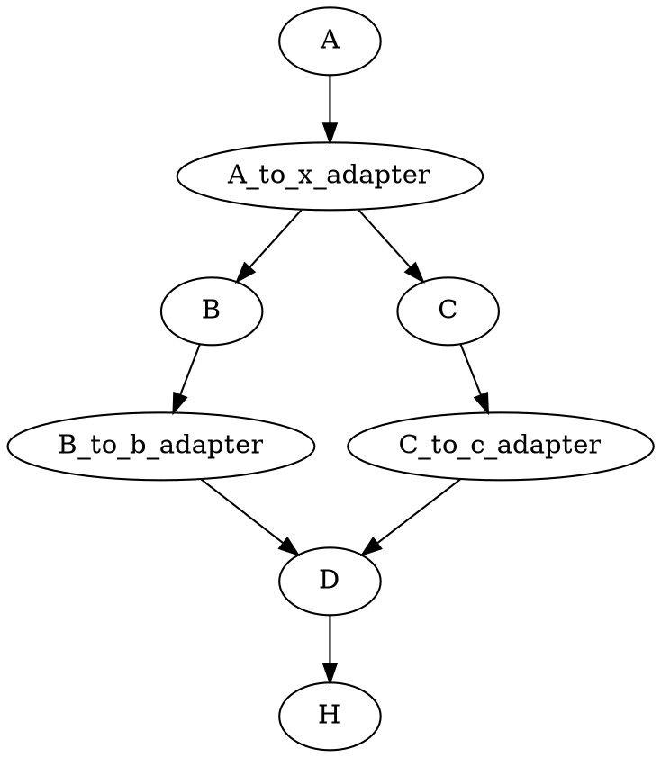

# Key-Based API 与声明式构图设计

## Taskflow 4.x 可重入模块与循环

| 需求 | 推荐 API | 运行契约 |
| --- | --- | --- |
| 静态可复用定义 | `create_subgraph_module` | 复用 `SubflowModule`，每次运行创建独立实例与结果槽 |
| 动态嵌套任务 | `create_subtask_module` | 执行期实例化 builder，并派生子 `RunContext` |
| 迭代控制 | `create_loop` | body 输出直接进入 condition，并可 feedback 到下一轮 |

模块输出必须显式绑定为 `external_key -> OutputPort{nested_node, nested_key}`。缺失、重复或
未声明的绑定会失败，不再返回占位 `std::any`。`RunContext` 提供
`run_id/parent_run_id/subtask_id/attempt/depth`，并递归传播取消和 deadline。

`LoopOptions::max_iterations` 统计已完成的 body 次数。body 先返回不可变的本轮结果，
计数递增，condition 再读取该结果；`feedback` 把已提交输出映射为下一轮输入。exit 对
正常完成、达到上限、取消、超时和错误终态都只执行一次。

Any 图支持顺序重跑；每轮后使用 `get_latest_output`。同一个 builder 禁止重叠执行，
并行 session 应使用不同 builder。

## ✅ 当前实现状态

### 已完成功能

1. **✅ Key-based 输出映射**
   - `TypedOutputs` 包含 `futures_map`，支持通过 key 访问输出
   - 所有输出都有明确的 key（构造函数指定或自动生成）
   - 同时保持类型安全和类型擦除两种访问方式
   - `TypedOutputs::get_typed<I>(key)` - 类型安全的 future 访问
   - `TypedOutputs::get_typed_by_key<T>(key)` - 运行时类型查找

2. **✅ 统一输出访问接口**
   - `INode::get_output_future(key)` - 获取 type-erased future（所有节点类型）
   - `INode::get_output_keys()` - 获取所有输出 key
   - 支持多态访问：`std::shared_ptr<INode>` 可以直接调用

3. **✅ 声明式构图 API**
   - `create_typed_source(name, values, output_keys)` - 创建源节点
   - `create_typed_node<Ins...>(name, input_specs, functor, output_keys)` - 创建节点
     - 输入类型：显式指定 `<Ins...>`
     - 输出类型：从 functor 返回类型自动推断
   - `create_any_source/node/sink()` - Any 节点创建
   - **自动依赖推断**：根据 `input_specs` 自动建立依赖关系

4. **✅ 输入辅助函数**
   - `get_input<T>(node_name, key)` - 获取类型化的输入（声明已添加）
   - `get_output(node_name, key)` - 获取 type-erased 输出

5. **✅ 适配器任务管理**
   - 自动创建适配器任务连接 Typed → Any
   - 适配器任务注册到 `adapter_tasks_` 映射
   - 依赖关系：优先使用 `adapter → target`，无适配器时使用 `source → target`

## 🎮 高级控制流节点

### 条件节点 (Condition Node)

使用声明式 API 创建条件分支：

```cpp
// 创建分支子图
auto C_task = builder.create_subgraph("C", [&](wf::GraphBuilder& gb){
  // 条件为 true 时的分支逻辑
  auto [src, _] = gb.create_typed_source("C_src", std::make_tuple(100.0), {"x"});
  auto [proc, _] = gb.create_typed_node<double>("C_proc", {{"C_src","x"}}, 
    [](const std::tuple<double>& in) {
      return std::make_tuple(std::get<0>(in) * 2.0);
    }, {"y"});
  auto [sink, _] = gb.create_any_sink("C_sink", {{"C_proc","y"}});
});

auto D_task = builder.create_subgraph("D", [&](wf::GraphBuilder& gb){
  // 条件为 false 时的分支逻辑
});

// 创建条件节点：返回 0 执行 C（true），返回 1 执行 D（false）
builder.create_condition_decl("B",
  {"A"},  // 先依赖节点 A
  []() { return (condition_value) ? 0 : 1; },
  {C_task, D_task}  // 后继节点
);
```

### 多条件节点 (Multi-Condition Node)

支持并行执行多个分支：

```cpp
builder.create_multi_condition_decl("F",
  {"E"},
  []() -> tf::SmallVector<int> {
    return {0, 2};  // 并行执行分支 0 和 2
  },
  {G_task, H_task, I_task}  // 多个后继节点
);
```

### 管道节点 (Pipeline Node)

创建结构化管道执行：

```cpp
builder.create_pipeline_node("Pipeline",
  std::make_tuple(
    tf::Pipe{tf::PipeType::SERIAL, [](tf::Pipeflow& pf) { /* 阶段 1 */ }},
    tf::Pipe{tf::PipeType::PARALLEL, [](tf::Pipeflow& pf) { /* 阶段 2 */ }},
    tf::Pipe{tf::PipeType::SERIAL, [](tf::Pipeflow& pf) { /* 阶段 3 */ }}
  ),
  4  // 4 条并行流水线
);
```

### 循环节点 (Loop Node)

使用 `create_subtask` 创建循环体（每次执行时重建并运行子图）：

```cpp
int counter = 0;

// 使用 create_subtask 重建并运行子图
auto loop_body_task = builder.create_subtask("LoopBody", [&counter](wf::GraphBuilder& gb){
  auto [trigger, _] = gb.create_typed_source("loop_trigger",
    std::make_tuple(counter), {"trigger"}
  );
  auto [process, _] = gb.create_typed_node<int>("loop_iteration",
    {{"loop_trigger", "trigger"}},
    [&counter](const std::tuple<int>&) {
      ++counter;
      return std::make_tuple(counter);
    },
    {"result"}
  );
  auto [sink, _] = gb.create_any_sink("loop_complete",
    {{"loop_iteration", "result"}},
    [](const std::unordered_map<std::string, std::any>& values){
      if (auto it = values.find("result"); it != values.end()) {
        std::cout << "  Loop iteration completed: counter = "
                  << std::any_cast<int>(it->second) << "\n";
      }
    }
  );
});

// 可选的退出动作子图
auto loop_exit_task = builder.create_subgraph("LoopExit", [](wf::GraphBuilder& gb){
  // 退出逻辑
});

// 创建循环：条件返回 0 继续，非 0 退出
// 注意：master 模式下返回 tf::Task（条件任务）
// input_specs 用于 condition_func 的输入，但不自动设置依赖
auto cond_task = builder.create_loop_decl(
  "Loop",
  {{"A", "value"}},  // input_specs: condition_func 可用的输入（不自动设置依赖）
  loop_body_task,
  [&counter](const std::unordered_map<std::string, std::any>& inputs) -> int {
    // inputs 从 input_specs 可用，但也可以使用捕获的 counter
    (void)inputs;  // 如果不需要可以从 input_specs 获取值
    return (counter < 5) ? 0 : 1;
  },
  loop_exit_task
);

// 依赖由 create_loop_decl 自动设置：
// - 来自 input_specs 的所有唯一源节点 -> body_task（初始触发）
// - body_task -> cond_task -> body_task（当 cond 返回 0 时，继续循环）
// - body_task -> cond_task -> exit_task（当 cond 返回非 0 时，退出循环）
// 如果 input_specs 为空，会创建一个空的开始任务来触发循环
```

**关键特性**：
- ✅ 循环体使用 `create_subtask` 支持多次迭代
- ✅ 参数通过 lambda 捕获传递
- ✅ 条件函数接收来自 `input_specs` 的输入
- ✅ 子图内部依赖自动推断
- ✅ **自动依赖设置**：来自 `input_specs` 的源节点自动连接到 `body_task`
- ✅ 如果 `input_specs` 为空，会创建一个空的开始任务来触发循环
- ✅ `input_specs` 为 `condition_func` 提供输入并自动连接初始依赖

### Sink 回调（结果收集/处理）

- Any Sink 回调：
```cpp
auto [sink, tSink] = builder.create_any_sink(
  "H", {{"D","prod"}},
  [](const std::unordered_map<std::string, std::any>& values){
    double prod = std::any_cast<double>(values.at("prod"));
    // 自定义处理/汇总
  }
);
```

- Typed Sink 回调：
```cpp
auto [tsink, tTask] = builder.create_typed_sink<double, int>(
  "T", {{"X","a"},{"Y","b"}},
  [](const std::tuple<double,int>& vals){
    auto [a,b] = vals; /* ... */
  }
);
```

### 噪声控制

为输出更可控，库内部默认去除了节点级的 "emitted"/"done" 打印；建议通过 Sink 回调进行精确日志输出。

### 测试 DOT 结构

循环示例（loop_only）：
```
Loop [diamond] -> LoopBody (0: continue)
Loop [diamond] -> LoopExit  (1: exit)
```

### 子图创建 (Subgraph)

创建可重用的工作流模块：

```cpp
auto module_task = builder.create_subgraph("ModuleName", [](wf::GraphBuilder& gb){
  // 在子图中使用声明式 API
  auto [A, _] = gb.create_typed_source("A", std::make_tuple(1.0), {"x"});
  auto [B, _] = gb.create_typed_node<double>("B", {{"A", "x"}}, /*...*/, {"y"});
  // 子图内的依赖关系自动推断
});

// 可作为主图的一部分或循环体使用
```

## 🧮 Taskflow 算法节点

Workflow 库提供了 Taskflow 并行算法的声明式封装，使你能够在数据流图中利用 Taskflow 的高效并行执行能力。

### 并行迭代：`create_for_each`

并行迭代容器元素：

```cpp
std::vector<int> numbers = {1, 2, 3, 4, 5};

// 创建包含容器的源节点
auto [input, _] = builder.create_any_source("Input",
  {{"data", std::any{numbers}}}
);

// 并行 for_each：对每个元素应用函数
auto [for_each_node, for_each_task] = builder.create_for_each<std::vector<int>>(
  "PrintElements",
  {{"Input", "data"}},  // 输入：来自 Input 节点的容器
  [](int value) {
    std::cout << "处理元素: " << value << "\n";
  },
  {}  // 无输出
);
```

**使用场景**：
- 独立处理每个元素
- 打印/日志记录容器元素
- 对元素执行副作用操作

### 并行索引迭代：`create_for_each_index`

并行迭代索引范围，并**收集返回值**：

```cpp
// 可选：创建共享参数源
auto [shared_params, _] = builder.create_any_source("SharedParams",
  {{"multiplier", std::any{2}}}
);

// 并行 for_each_index：迭代索引并收集返回值
// 索引范围作为函数参数传递，而非从 input_specs 获取
auto [index_node, index_task] = builder.create_for_each_index<int, int>(
  "ProcessIndices",
  {{"SharedParams", "multiplier"}},  // 可选的共享参数
  0,   // first: 起始索引（包含）
  20,  // last: 结束索引（不包含）
  2,   // step: 步长
  std::function<int(int, std::unordered_map<std::string, std::any>&)>(
    [](int index, std::unordered_map<std::string, std::any>& shared_params) -> int {
      int multiplier = std::any_cast<int>(shared_params.at("multiplier"));
      int result = index * multiplier;
      std::cout << "索引: " << index << ", 乘积: " << result << "\n";
      return result;  // 返回值收集到 vector 中
    }
  ),
  {"results"}  // 输出键：存储收集的 std::vector<int> 结果
);

// 从后续节点访问收集的结果
auto [display_node, display_task] = builder.create_any_sink("DisplayResults",
  {{"ProcessIndices", "results"}},
  [](const std::unordered_map<std::string, std::any>& inputs) {
    const std::vector<int>& results = std::any_cast<const std::vector<int>&>(inputs.at("results"));
    std::cout << "收集了 " << results.size() << " 个结果\n";
  }
);
```

**API 签名**：
```cpp
template <typename IndexType, typename ReturnType = std::any>
std::pair<std::shared_ptr<AnyNode>, tf::Task>
create_for_each_index(const std::string& name,
                      const std::vector<std::pair<std::string, std::string>>& input_specs,
                      IndexType first,      // 起始索引（包含）
                      IndexType last,       // 结束索引（不包含）
                      IndexType step,      // 步长
                      std::function<ReturnType(IndexType, 
                                        std::unordered_map<std::string, std::any>&)> callable,
                      const std::vector<std::string>& output_keys = {"result"});
```

**参数说明**：
- `input_specs`: 可选的共享参数（索引范围**不**从 input_specs 获取）
- `first`, `last`, `step`: 索引范围参数直接传递
- `callable`: 函数接收 `(index, shared_params)` 并**返回 `ReturnType`**
  - 返回值收集到 `std::vector<ReturnType>` 并存储在第一个 `output_key` 中
  - 支持 `std::any`（默认）和类型化返回值（如 `int`, `double`）
- `output_keys`: 输出键 - 第一个键（默认："result"）存储收集的结果向量

**关键特性**：
- ✅ 返回值收集：所有返回值收集到 `std::vector<ReturnType>`
- ✅ 线程安全的并行收集（使用互斥锁保护）
- ✅ 支持 `std::any` 和类型化返回值
- ✅ 共享参数可在迭代间修改

### 并行归约：`create_reduce`

使用二元操作符将容器归约为单个值：

```cpp
std::vector<int> numbers = {1, 2, 3, 4, 5};

// 创建源节点
auto [input, _] = builder.create_any_source("Input",
  {{"data", std::any{numbers}}}
);

// 并行 reduce：计算总和
int sum_result = 0;
auto [reduce_node, reduce_task] = builder.create_reduce<int, std::vector<int>>(
  "SumElements",
  {{"Input", "data"}},
  sum_result,  // 初始值（通过引用捕获，必须保持存活）
  [](int acc, int val) { return acc + val; },  // 二元操作符
  {"sum"}  // 输出键
);

// 通过输出键或 sum_result 变量访问结果
```

**重要提示**：
- `init` 通过**引用**捕获 - 在执行期间必须保持存活
- 结果存储在 `init` 中，**同时**通过输出键暴露
- 二元操作符必须满足结合律和交换律以确保正确性

**使用场景**：
- 求和、乘积、最小值、最大值操作
- 聚合容器值
- 统计计算

### 并行变换：`create_transform`

变换容器元素，生成新容器：

```cpp
std::vector<int> input = {1, 2, 3, 4, 5};

// 创建源节点
auto [input_node, _] = builder.create_any_source("Input",
  {{"data", std::any{input}}}
);

// 并行 transform：对每个元素求平方
auto [transform_node, transform_task] = builder.create_transform<
  std::vector<int>,      // 输入容器类型
  std::vector<int>,      // 输出容器类型
  std::function<int(int)> // 一元操作类型
>(
  "SquareElements",
  {{"Input", "data"}},
  [](int x) { return x * x; },  // 一元操作
  {"squared"}  // 输出键
);

// 在后续节点中使用变换后的容器
auto [sink, _] = builder.create_any_sink("Sink",
  {{"SquareElements", "squared"}}
);
```

**使用场景**：
- 逐元素数学运算
- 数据格式转换
- 过滤/映射操作

### 完整算法工作流示例

参见 `examples/algorithm_example.cpp` 了解结合多个算法的完整示例：

```cpp
#include <workflow/nodeflow.hpp>
#include <taskflow/taskflow.hpp>

int main() {
  namespace wf = workflow;
  tf::Executor executor;
  wf::GraphBuilder builder("algorithm_workflow");

  // 1. 创建输入数据
  std::vector<int> numbers = {1, 2, 3, 4, 5, 6, 7, 8, 9, 10};
  auto [input, _] = builder.create_any_source("Input",
    {{"data", std::any{numbers}}}
  );

  // 2. 并行 for_each：打印元素
  auto [for_each, _] = builder.create_for_each<std::vector<int>>(
    "PrintElements",
    {{"Input", "data"}},
    [](int val) { std::cout << "元素: " << val << "\n"; }
  );

  // 3. 并行 transform：对元素求平方
  auto [transform, _] = builder.create_transform<
    std::vector<int>, std::vector<int>,
    std::function<int(int)>
  >(
    "SquareElements",
    {{"Input", "data"}},
    [](int x) { return x * x; },
    {"squared"}
  );

  // 4. 并行 reduce：对平方后的元素求和
  int sum = 0;
  auto [reduce, _] = builder.create_reduce<int, std::vector<int>>(
    "SumSquares",
    {{"SquareElements", "squared"}},
    sum,
    [](int acc, int val) { return acc + val; },
    {"sum"}
  );

  // 5. 收集结果
  auto [sink, _] = builder.create_any_sink("FinalSink",
    {{"SumSquares", "sum"}},
    [](const auto& values) {
      int result = std::any_cast<int>(values.at("sum"));
      std::cout << "平方和: " << result << "\n";
    }
  );

  // 所有依赖关系自动推断！
  builder.run(executor);
  return 0;
}
```

### 算法节点集成优势

1. **一致的 API**：与普通节点相同的声明式模式
2. **自动依赖**：输入规范自动建立依赖关系
3. **并行执行**：利用 Taskflow 的高效工作窃取调度器
4. **键控 I/O**：输出通过字符串键访问，便于链式调用
5. **类型安全**：基于模板的容器和操作类型检查

### 性能考虑

- **并行执行**：算法利用 Taskflow 的并行调度器实现多核性能
- **工作窃取**：跨工作线程的高效负载均衡
- **零拷贝**：容器引用高效传递（无不必要的拷贝）
- **开销**：最小的包装开销；执行主要由算法实现主导

### 实现说明

算法节点作为 `AnyNode` 包装器实现：
1. 在执行时从输入 future 中提取容器/数据
2. 创建临时的 `tf::Taskflow` 实例用于算法执行
3. 使用 `executor_->run(taskflow).wait()` 同步执行算法
4. 通过字符串键控的输出暴露结果，便于链式调用

这种设计使得算法节点能够：
- 通过统一接口与类型化和 any-based 节点协作
- 利用 Taskflow 的高效并行算法
- 保持一致的声明式 API 模式

## 🎯 技术特点

### 1. Key-based I/O 系统

**数据结构**：

**TypedOutputs** (编译时类型安全)：
```cpp
template <typename... Outs>
struct TypedOutputs {
  // 类型化的 futures（索引访问）
  std::tuple<std::shared_ptr<std::promise<Outs>>...> promises;
  std::tuple<std::shared_future<Outs>...> futures;
  
  // Key-based 访问（类型擦除）
  std::unordered_map<std::string, std::shared_future<std::any>> futures_map;
  std::vector<std::string> output_keys;  // 有序 key 列表
  std::unordered_map<std::string, std::size_t> key_to_index_;  // key → 索引映射
  
  // Any promises（用于同步）
  std::unordered_map<std::size_t, std::shared_ptr<std::promise<std::any>>> any_promises_;
};
```

**AnyOutputs** (运行时类型擦除)：
```cpp
struct AnyOutputs {
  std::unordered_map<std::string, std::shared_ptr<std::promise<std::any>>> promises;
  std::unordered_map<std::string, std::shared_future<std::any>> futures;
};
```

**访问方式对比**：

```cpp
// 方式 1: 索引访问（类型安全，但需要知道顺序）
auto x_fut = std::get<0>(A->out.futures);  // double

// 方式 2: Key 访问 - 类型安全（需要知道索引）
auto x_fut = A->out.get_typed<0>("x");  // double

// 方式 3: Key 访问 - 类型安全（运行时查找）
auto x_fut = A->out.get_typed_by_key<double>("x");  // double

// 方式 4: Key 访问 - 类型擦除（统一接口）
auto x_any_fut = A->get_output_future("x");  // shared_future<any>
```

### 2. 声明式构图 API

**输入规范格式**：
```cpp
std::vector<std::pair<std::string, std::string>> input_specs;
// 格式：{{"source_node_name", "source_output_key"}, ...}

// 示例：
{{"A", "x"}}                    // 单输入
{{"B", "b"}, {"C", "c"}}        // 多输入
{{"D", "prod"}, {"G", "sum"}}    // 多输入（可来自不同源）
```

**自动依赖推断机制**：

```cpp
// 在 create_typed_node 中：
for (const auto& [source_node, source_key] : input_specs) {
  const std::string adapter_key = source_node + "::" + source_key;
  auto adapter_it = adapter_tasks_.find(adapter_key);
  
  if (adapter_it != adapter_tasks_.end()) {
    // 使用适配器任务作为依赖
    adapter_it->second.precede(task);
  } else {
    // 直接使用源节点作为依赖
    source_task_it->second.precede(task);
  }
}
```

**适配器任务创建**：

```cpp
// 在 get_typed_input_impl 中：
// 当需要从 Typed 节点获取类型化 future 时
auto any_fut = node->get_output_future(key);  // 获取 any future

// 创建适配器 promise/future
auto p_typed = std::make_shared<std::promise<T>>();
auto f_typed = p_typed->get_future().share();

// 创建适配器任务：any → typed
auto adapter_task = taskflow_.emplace([any_fut, p_typed]() {
  std::any value = any_fut.get();
  T typed_value = std::any_cast<T>(value);
  p_typed->set_value(std::move(typed_value));
}).name(node_name + "_to_" + key + "_adapter");

// 注册适配器
adapter_tasks_[node_name + "::" + key] = adapter_task;

// 建立依赖：source → adapter
source_task.precede(adapter_task);
```

### 3. 类型推断系统

**输入类型**：必须显式指定
```cpp
auto [B, _] = builder.create_typed_node<double>(  // <double> 是输入类型
  "B", {{"A", "x"}}, /*functor*/, {"b"}
);
```

**输出类型**：从 functor 返回类型自动推断
```cpp
// Functor 返回类型推断
using ReturnType = typename std::invoke_result<OpType, TestInput>::type;
// ReturnType = tuple<Outs...>

// 提取输出类型
using OutsTuple = ReturnType;
// 创建节点类型
using NodeType = TypedNode<InputsTuple, std::tuple_element_t<OutIndices, OutsTuple>...>;
```

## 📝 使用样例

### 样例 1: 基本声明式构图

**代码**：

```cpp
#include <workflow/nodeflow.hpp>
#include <taskflow/taskflow.hpp>

int main() {
  namespace wf = workflow;
  tf::Executor executor;
  wf::GraphBuilder builder("example");

  // 创建源节点
  auto [A, tA] = builder.create_typed_source("A",
    std::make_tuple(3.5, 7),
    {"x", "k"}
  );

  // 创建节点 B: A::x -> b (x+1)
  auto [B, tB] = builder.create_typed_node<double>("B",
    {{"A", "x"}},
    [](const std::tuple<double>& in) {
      return std::make_tuple(std::get<0>(in) + 1.0);
    },
    {"b"}
  );

  // 创建节点 C: A::x -> c (2*x)
  auto [C, tC] = builder.create_typed_node<double>("C",
    {{"A", "x"}},
    [](const std::tuple<double>& in) {
      return std::make_tuple(2.0 * std::get<0>(in));
    },
    {"c"}
  );

  // 创建节点 D: B::b, C::c -> prod (b*c)
  auto [D, tD] = builder.create_typed_node<double, double>("D",
    {{"B", "b"}, {"C", "c"}},
    [](const std::tuple<double, double>& in) {
      return std::make_tuple(std::get<0>(in) * std::get<1>(in));
    },
    {"prod"}
  );

  // 创建接收节点
  auto [H, tH] = builder.create_any_sink("H",
    {{"D", "prod"}}
  );

  // 执行（依赖自动建立）
  builder.run(executor);
  return 0;
}
```

**数据流图**：


```dot
digraph example {
  A -> A_to_x_adapter
  A_to_x_adapter -> B
  A_to_x_adapter -> C
  B -> B_to_b_adapter
  C -> C_to_c_adapter
  B_to_b_adapter -> D
  C_to_c_adapter -> D
  D -> H
}
```

**依赖关系**（自动推断）：
- `B` 依赖于 `A` (via `{"A", "x"}`)
- `C` 依赖于 `A` (via `{"A", "x"}`)
- `D` 依赖于 `B, C` (via `{{"B", "b"}, {"C", "c"}}`)
- `H` 依赖于 `D` (via `{"D", "prod"}`)

### 样例 2: 多输出节点

```cpp
// 节点 G: 三个输入，两个输出
auto [G, tG] = builder.create_typed_node<double, double, int>("G",
  {{"C", "c"}, {"B", "b"}, {"E", "ek"}},
  [](const std::tuple<double, double, int>& in) {
    double sum = std::get<0>(in) + std::get<1>(in);
    int parity = (std::get<2>(in) % 2 + 2) % 2;
    return std::make_tuple(sum, parity);  // 返回 tuple<double, int>
  },
  {"sum", "parity"}  // 两个输出 key
);

// 使用多个输出
auto [H, tH] = builder.create_any_sink("H",
  {{"G", "sum"}, {"G", "parity"}}  // 从同一节点获取多个输出
);
```

**数据细节**：
- `G` 的输出：`{"sum": shared_future<double>, "parity": shared_future<int>}`
- `H` 的输入：`{"sum": shared_future<any>, "parity": shared_future<any>}`

### 样例 3: Any-based 节点

```cpp
// Any 源节点
auto [A, tA] = builder.create_any_source("A",
  std::unordered_map<std::string, std::any>{
    {"x", std::any{3.5}},
    {"k", std::any{7}}
  }
);

// Any 节点
auto [B, tB] = builder.create_any_node("B",
  {{"A", "x"}},
  [](const std::unordered_map<std::string, std::any>& in) {
    double x = std::any_cast<double>(in.at("x"));
    return std::unordered_map<std::string, std::any>{
      {"b", std::any{x + 1.0}}
    };
  },
  {"b"}
);

// Any 接收节点
auto [H, tH] = builder.create_any_sink("H",
  {{"B", "b"}}
);
```

**数据细节**：
- 输入/输出都使用 `unordered_map<string, any>`
- 运行时类型转换：`std::any_cast<T>`
- 类型安全由程序员保证（运行时检查）

### 样例 4: 混合 Typed/Any 工作流

```cpp
// Typed 计算节点（性能优先）
auto [D, tD] = builder.create_typed_node<double, double>("D",
  {{"B", "b"}, {"C", "c"}},
  [](const std::tuple<double, double>& in) {
    return std::make_tuple(std::get<0>(in) * std::get<1>(in));
  },
  {"prod"}
);

// Any 接收节点（灵活性优先）
auto [H, tH] = builder.create_any_sink("H",
  {{"D", "prod"}, {"G", "sum"}, {"G", "parity"}}
);
```

**适配器机制**：
- 当 `H` 从 `D` 获取 `"prod"` 时：
  1. `D->get_output_future("prod")` 返回 `shared_future<any>`
  2. 适配器任务 `D_to_prod_adapter` 自动创建
  3. 适配器提取 `double` 值并包装为 `any`
  4. 依赖关系：`D → D_to_prod_adapter → H`

## 🔍 技术细节

### 适配器任务生命周期

1. **创建时机**：在 `get_typed_input_impl<T>()` 中，当需要从 Any 输出获取 Typed 输入时
2. **注册**：保存到 `adapter_tasks_["source::key"]`
3. **依赖建立**：
   - `source_task → adapter_task` (在创建时)
   - `adapter_task → target_task` (在 `create_typed_node` 中)

### 类型转换流程

**Typed → Any** (适配器任务)：
```
TypedSource emits: double (3.5)
  ↓
TypedOutputs sets: promise<double> + promise<any>
  ↓
Adapter task: any_fut.get() → any_cast<double> → promise<T>
  ↓
TypedNode receives: shared_future<T>
```

**Any → Typed** (直接访问)：
```
AnyNode emits: map<string, any>
  ↓
AnyOutputs sets: promise<any>
  ↓
TypedNode: any_fut.get() → any_cast<T> (via adapter)
```

### 依赖推断算法

```cpp
// 伪代码
for each input_spec in input_specs:
  source_node = input_spec.first
  source_key = input_spec.second
  
  adapter_key = source_node + "::" + source_key
  
  if adapter_tasks_.contains(adapter_key):
    // 适配器已存在，使用适配器
    adapter_tasks_[adapter_key].precede(target_task)
  else:
    // 无适配器，直接连接源节点
    tasks_[source_node].precede(target_task)
```

### 内存模型

**Typed 节点**：
- 每个输出：1个 `shared_ptr<promise<T>>` + 1个 `shared_future<T>` (类型化)
- 每个输出：1个 `shared_ptr<promise<any>>` + 1个 `shared_future<any>` (类型擦除)
- 总内存：`2 * sizeof(shared_ptr) * num_outputs` (约 32 bytes/输出)

**Any 节点**：
- 每个输出：1个 `shared_ptr<promise<any>>` + 1个 `shared_future<any>`
- 总内存：`2 * sizeof(shared_ptr) * num_outputs` (约 32 bytes/输出)

**适配器任务**：
- 1个 `shared_ptr<promise<T>>` + 1个 `shared_future<T>`
- 1个 Taskflow task 对象
- 总内存：约 100-200 bytes/适配器

## 📊 性能特性

### 类型化访问（零开销）

```cpp
// 编译时类型已知，零运行时开销
auto x_fut = A->out.get_typed<0>("x");  // 直接返回 tuple 元素
```

### 类型擦除访问（最小开销）

```cpp
// 运行时查找 key，类型擦除（~1-2ns）
auto x_any_fut = A->get_output_future("x");  // map 查找 + any 包装
```

### 适配器任务开销

- **创建开销**：1个额外任务对象（~100 bytes）
- **执行开销**：1个额外任务调度（~100ns）
- **内存开销**：适配器 promise/future 对（~32 bytes）

## 🎯 最佳实践

### 1. 优先使用声明式 API

**✅ 推荐**：
```cpp
auto [B, _] = builder.create_typed_node<double>("B",
  {{"A", "x"}}, /*functor*/, {"b"});
// 依赖自动推断
```

**❌ 不推荐**：
```cpp
auto B = std::make_shared<wf::TypedNode</*...*/>>(/*...*/);
auto tB = builder.add_typed_node(B);
builder.precede(tA, std::vector<tf::Task>{tB});  // 手动依赖
```

### 2. 使用有意义的输出 keys

**✅ 推荐**：
```cpp
{"x", "y", "sum", "product"}  // 语义清晰
```

**❌ 不推荐**：
```cpp
{"out0", "out1", "out2"}  // 自动生成，但缺少语义
```

### 3. 输入类型显式指定

**✅ 正确**：
```cpp
builder.create_typed_node<double, double>("D",  // 明确两个 double 输入
  {{"B", "b"}, {"C", "c"}}, /*functor*/, {"prod"});
```

**❌ 错误**：
```cpp
builder.create_typed_node("D",  // 缺少输入类型
  {{"B", "b"}, {"C", "c"}}, /*functor*/, {"prod"});
```

### 4. Functor 签名匹配

**✅ 正确**：
```cpp
builder.create_typed_node<double>("B",
  {{"A", "x"}},
  [](const std::tuple<double>& in) {  // 接收 tuple<double>
    return std::make_tuple(std::get<0>(in) + 1.0);  // 返回 tuple<...>
  },
  {"b"}
);
```

**❌ 错误**：
```cpp
builder.create_typed_node<double>("B",
  {{"A", "x"}},
  [](double x) { return x + 1.0; },  // 签名不匹配
  {"b"}
);
```

## 🔮 未来改进方向

### Phase 1: 输入类型自动推断 ⏳

```cpp
// 未来：从输入规范自动推断输入类型
auto [B, _] = builder.create_typed_node("B",  // 无需指定 <double>
  {{"A", "x"}},  // 从 A 的输出类型推断输入类型
  /*functor*/, {"b"});
```

### Phase 2: 完全类型无关的 Functor ⏳

```cpp
// 未来：完全基于 key 访问，无类型信息
auto [B, _] = builder.create_typed_node("B",
  {{"A", "x"}},
  [](const auto& inputs) {  // 接收 key-value map
    double x = inputs.at("x").get<double>();
    return std::make_tuple(x + 1.0);
  },
  {"b"}
);
```

### Phase 3: 声明式链式 API ⏳

```cpp
// 未来：完全声明式链式调用
builder
  .source("A", std::make_tuple(3.5, 7), {"x", "k"})
  .node("B", inputs("A::x"), [](auto x){return x+1;}, outputs("b"))
  .node("D", inputs("B::b", "C::c"), [](auto b, auto c){return b*c;}, outputs("prod"))
  .sink("H", inputs("D::prod"))
  .run(executor);
```

## 📈 对比总结

| 特性 | 传统 API | Key-based API | 声明式 API |
|------|---------|---------------|------------|
| **输入指定** | 手动获取 futures | Key 访问 | Input specs |
| **依赖管理** | 手动 `precede/succeed` | 手动 `precede/succeed` | 自动推断 ✅ |
| **代码量** | 多 | 中等 | 少 ✅ |
| **可读性** | 中 | 高 ✅ | 最高 ✅ |
| **类型安全** | 是 | 是 | 是 |
| **灵活性** | 中 | 高 | 最高 ✅ |

**推荐使用顺序**：
1. 🥇 **声明式 API** - 新代码首选
2. 🥈 **Key-based API** - 需要精细控制时
3. 🥉 **传统 API** - 向后兼容，已标记 deprecated

### 算法节点 API 总结

**声明式 API**：

```cpp
// for_each - 并行迭代容器（支持共享参数）
builder.create_for_each<Container>("Name",
  {{"SourceNode", "container_key"}, {"SharedParams", "param_key"}},  // 第一个是容器，其余是共享参数
  std::function<void(ElementType, std::unordered_map<std::string, std::any>&)>(
    [](ElementType elem, std::unordered_map<std::string, std::any>& shared_params) {
      // shared_params 可修改，在所有迭代间共享
      /* process */
    }
  ),
  {"output_keys"}  // 可选
);

// for_each_index - 并行迭代索引范围（索引范围作为函数参数）
builder.create_for_each_index<IndexType, ReturnType>("Name",
  {{"SharedParams", "param_key"}},  // 可选的共享参数（索引范围不在 input_specs 中）
  0,   // first: 起始索引（包含）
  20,  // last: 结束索引（不包含）
  2,   // step: 步长
  std::function<ReturnType(IndexType, std::unordered_map<std::string, std::any>&)>(
    [](IndexType idx, std::unordered_map<std::string, std::any>& shared_params) -> ReturnType {
      // shared_params 可修改，在所有迭代间共享
      /* process */
      ReturnType result = /* ... */;
      return result;  // 返回值收集到 vector
    }
  ),
  {"result"}  // 输出键：存储收集的 std::vector<ReturnType>
);

// reduce - 并行归约（支持共享参数）
T init = /* initial value */;  // 必须保持存活（通过引用捕获）
builder.create_reduce<T, Container>("Name",
  {{"SourceNode", "container_key"}, {"SharedParams", "param_key"}},  // 第一个是容器，其余是共享参数
  init,  // 通过引用捕获，必须保持存活
  std::function<T(T, ElementType, std::unordered_map<std::string, std::any>&)>(
    [](T acc, ElementType val, std::unordered_map<std::string, std::any>& shared_params) -> T {
      // shared_params 可修改，在所有归约操作间共享
      return /* reduction */;
    }
  ),
  {"result"}
);

// transform - 并行变换
builder.create_transform<InputContainer, OutputContainer>("Name",
  {{"SourceNode", "container_key"}},  // 容器输入（仅一个）
  std::function<OutputElement(InputElement)>(
    [](InputElement elem) -> OutputElement {
      return /* transform */;
    }
  ),
  {"result"}
);
```

**关键特性**：
- ✅ 与普通节点相同的声明式 API 模式
- ✅ 字符串键控的输入/输出
- ✅ 自动依赖推断
- ✅ 并行执行（Taskflow 调度器）
- ✅ 无缝集成到现有工作流中
- ✅ 支持共享参数（`for_each`, `for_each_index`, `reduce`）
- ✅ 使用 `std::function` 明确函数签名
- ✅ `for_each_index` 的索引范围作为函数参数传递，而非从 `input_specs` 提取

## 📚 相关文档

- `workflow/README.md` - 完整库文档（包含算法节点详细说明）
- `readme/guide_workflow.md` - 技术路线与实现细节
- `examples/declarative_example.cpp` - 声明式 API 完整示例
- `examples/unified_example.cpp` - Key-based API 示例
- `examples/algorithm_example.cpp` - 算法节点使用示例
- `examples/advanced_control_flow.cpp` - 高级控制流示例
- `examples/loop_only.cpp` - 循环控制流示例


```dot
digraph Taskflow {
subgraph cluster_p0x7ffeb8d8d840 {
label="Taskflow: advanced_control_flow";
p0x5c201bb0a500[label="A" ];
p0x5c201bb0a500 -> p0x5c201bb0d720;
p0x5c201bb0a500 -> p0x5c201bb12dc0;
p0x5c201bb0dea0[label="E" ];
p0x5c201bb0dea0 -> p0x5c201bb10bc0;
p0x5c201bb113b0[shape=box3d, color=blue, label="Pipeline [m1]"];
p0x5c201bb0d720[label="B" shape=diamond color=black fillcolor=aquamarine style=filled];
p0x5c201bb0d720 -> p0x5c201bb0bdb0 [style=dashed label="0"];
p0x5c201bb0d720 -> p0x5c201bb0d640 [style=dashed label="1"];
p0x5c201bb0bdb0[shape=box3d, color=blue, label="C [m2]"];
p0x5c201bb0ec70[shape=box3d, color=blue, label="G [m3]"];
p0x5c201bb0fbb0[shape=box3d, color=blue, label="H [m4]"];
p0x5c201bb10ae0[shape=box3d, color=blue, label="I [m5]"];
p0x5c201bb10bc0[label="F" shape=diamond color=black fillcolor=aquamarine style=filled];
p0x5c201bb10bc0 -> p0x5c201bb0ec70 [style=dashed label="0"];
p0x5c201bb10bc0 -> p0x5c201bb0fbb0 [style=dashed label="1"];
p0x5c201bb10bc0 -> p0x5c201bb10ae0 [style=dashed label="2"];
p0x5c201bb0d640[shape=box3d, color=blue, label="D [m6]"];
p0x5c201bb12dc0[shape=box3d, color=blue, label="LoopBody [m7]"];
p0x5c201bb12dc0->p0x5c201bb146e0;
p0x5c201bb14600[shape=box3d, color=blue, label="LoopExit [m8]"];
p0x5c201bb146e0[label="Loop" shape=diamond color=black fillcolor=aquamarine style=filled];
p0x5c201bb146e0 -> p0x5c201bb12dc0 [style=dashed label="0"];
p0x5c201bb146e0 -> p0x5c201bb14600 [style=dashed label="1"];
}
subgraph cluster_p0x5c201bb12ef0 {
label="m8";
p0x5c201bb13900[label="exit_msg" ];
p0x5c201bb13900 -> p0x5c201bb13a00;
p0x5c201bb13a00[label="exit_msg_to_msg_adapter" ];
p0x5c201bb13a00 -> p0x5c201bb14330;
p0x5c201bb14330[label="exit_print" ];
p0x5c201bb14330 -> p0x5c201bb144e0;
p0x5c201bb144e0[label="exit_sink" ];
}
subgraph cluster_p0x5c201bb115c0 {
label="m7";
p0x5c201bb12090[label="loop_trigger" ];
p0x5c201bb12090 -> p0x5c201bb12190;
p0x5c201bb12190[label="loop_trigger_to_trigger_adapter" ];
p0x5c201bb12190 -> p0x5c201bb12af0;
p0x5c201bb12af0[label="loop_iteration" ];
p0x5c201bb12af0 -> p0x5c201bb12ca0;
p0x5c201bb12ca0[label="loop_complete" ];
}
subgraph cluster_p0x5c201bb0bee0 {
label="m6";
p0x5c201bb0c920[label="D_src" ];
p0x5c201bb0c920 -> p0x5c201bb0ca00;
p0x5c201bb0ca00[label="D_src_to_x_adapter" ];
p0x5c201bb0ca00 -> p0x5c201bb0d370;
p0x5c201bb0d370[label="D_proc" ];
p0x5c201bb0d370 -> p0x5c201bb0d520;
p0x5c201bb0d520[label="D_sink" ];
}
subgraph cluster_p0x5c201bb0fce0 {
label="m5";
p0x5c201bb107a0[label="Si" ];
p0x5c201bb107a0 -> p0x5c201bb109a0;
p0x5c201bb109a0[label="Ki" ];
}
subgraph cluster_p0x5c201bb0eda0 {
label="m4";
p0x5c201bb0f890[label="Sh" ];
p0x5c201bb0f890 -> p0x5c201bb0fa90;
p0x5c201bb0fa90[label="Kh" ];
}
subgraph cluster_p0x5c201bb0dfd0 {
label="m3";
p0x5c201bb0e950[label="Sg" ];
p0x5c201bb0e950 -> p0x5c201bb0eb50;
p0x5c201bb0eb50[label="Kg" ];
}
subgraph cluster_p0x5c201bb0a630 {
label="m2";
p0x5c201bb0b070[label="C_src" ];
p0x5c201bb0b070 -> p0x5c201bb0b170;
p0x5c201bb0b170[label="C_src_to_x_adapter" ];
p0x5c201bb0b170 -> p0x5c201bb0bae0;
p0x5c201bb0bae0[label="C_proc" ];
p0x5c201bb0bae0 -> p0x5c201bb0bc90;
p0x5c201bb0bc90[label="C_sink" ];
}
subgraph cluster_p0x5c201bb10d80 {
label="m1";
p0x5c201bb10f30[label="cond" shape=diamond color=black fillcolor=aquamarine style=filled];
p0x5c201bb10f30 -> p0x5c201bb11010 [style=dashed label="0"];
p0x5c201bb10f30 -> p0x5c201bb11110 [style=dashed label="1"];
p0x5c201bb10f30 -> p0x5c201bb111f0 [style=dashed label="2"];
p0x5c201bb10f30 -> p0x5c201bb112d0 [style=dashed label="3"];
p0x5c201bb11010[label="nprt-0" ];
p0x5c201bb11110[label="nprt-1" ];
p0x5c201bb111f0[label="nprt-2" ];
p0x5c201bb112d0[label="nprt-3" ];
}
}
```
