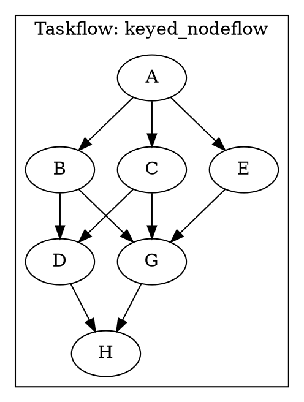

# Workflow: String-Keyed Nodeflow Library

A Taskflow-based dataflow library with string-keyed heterogeneous inputs/outputs using `std::unordered_map<std::string, std::any>`.

## Overview

The Workflow library provides a high-level abstraction for building dataflow graphs where nodes communicate through named channels (string keys) rather than positional arguments. This design enables:

- **Self-documenting code**: Node inputs/outputs are identified by meaningful string keys
- **Flexible composition**: Nodes can be easily connected by matching keys
- **Type safety with flexibility**: Uses `std::any` for type-erased values while maintaining clear semantics
- **Parallel execution**: Built on Taskflow for efficient concurrent task execution

## Features

- **String-keyed I/O**: All node inputs/outputs are accessed via string keys in unordered_map, enabling flexible key-based access and template-friendly node functions.
- **Heterogeneous types**: Uses `std::any` for type-erased values, supporting any C++ type.
- **Taskflow integration**: Built on top of Taskflow for efficient parallel execution.
- **Clean API**: Simple node creation with lambda functions for easy integration.

## Directory Structure

```
workflow/
├── include/workflow/
│   └── nodeflow.hpp       # Main library header
├── src/                   # (Reserved for future .cpp implementations)
├── examples/
│   └── keyed_example.cpp # Example usage
└── CMakeLists.txt        # Build configuration
```

## Example Program: keyed_example

The `keyed_example.cpp` demonstrates a complete workflow with multiple nodes performing arithmetic operations.

### Program Description

This example implements the following computation graph:

```
A: emits {"x": 3.5, "k": 7}
  ↓
  ├─→ B: {"x"} → {"b": x+1}
  ├─→ C: {"x"} → {"c": 2*x}
  └─→ E: {"k"} → {"ek": k-2}
       ↓
       ├─→ D: {"b", "c"} → {"prod": b*c}
       └─→ G: {"c", "b", "ek"} → {"sum": c+b, "parity": ek%2}
            ↓
            H: prints {"prod", "sum", "parity"}
```

### Data Flow

- **Node A (Source)**: Produces two values: `x = 3.5` (double) and `k = 7` (int)
- **Node B**: Computes `b = x + 1 = 4.5`
- **Node C**: Computes `c = 2 * x = 7.0`
- **Node E**: Computes `ek = k - 2 = 5`
- **Node D**: Computes `prod = b * c = 4.5 * 7.0 = 31.5`
- **Node G**: Computes two values:
  - `sum = c + b = 7.0 + 4.5 = 11.5`
  - `parity = ek % 2 = 5 % 2 = 1`
- **Node H (Sink)**: Prints the final results

### Expected Output

```
A emitted
E done
C done
B done
G done
D done
H: parity=1 sum=11.5 prod=31.5
```

### Execution Graph (DOT Format)

The program outputs a DOT graph description that can be visualized:



Visualization:
- **A** (source) has three outgoing edges to B, C, E
- **B** and **C** feed into both **D** and **G**
- **E** feeds into **G**
- **D** and **G** both feed into **H** (sink)

### Code Structure

The example shows:
1. Creating a source node with multiple heterogeneous outputs
2. Creating transform nodes that consume specific inputs by key
3. Creating nodes with multiple outputs
4. Wiring nodes together using `out.futures.at("key")` syntax
5. Creating a sink node to consume and display final results

## Usage

### Basic Example

```cpp
#include <workflow/nodeflow.hpp>
#include <taskflow/taskflow.hpp>

namespace wf = workflow;

int main() {
  tf::Executor executor;
  tf::Taskflow tf("my_workflow");

  // Source: emit initial values
  wf::AnySource A({{"x", std::any{3.5}}, {"k", std::any{7}}});

  // Node: transform inputs to outputs
  wf::AnyNode B(
      {{"x", A.out.futures.at("x")}},  // inputs
      {"b"},                            // output keys
      [](const std::unordered_map<std::string, std::any>& in) {
        double x = std::any_cast<double>(in.at("x"));
        return std::unordered_map<std::string, std::any>{{"b", x + 1.0}};
      }
  );

  // Sink: consume final values
  wf::AnySink H({{"b", B.out.futures.at("b")}});

  // Create tasks and dependencies
  auto tA = tf.emplace(A.functor("A")).name("A");
  auto tB = tf.emplace(B.functor("B")).name("B");
  auto tH = tf.emplace(H.functor("H")).name("H");

  tA.precede(tB);
  tB.precede(tH);

  executor.run(tf).wait();
  return 0;
}
```

## Building

### As Subdirectory (Recommended)

From the taskflow root:

```bash
mkdir build && cd build
cmake .. -DTF_BUILD_WORKFLOW=ON
cmake --build . --target keyed_example
./workflow/keyed_example
```

The workflow library is built automatically when `TF_BUILD_WORKFLOW=ON` (default).

### Standalone

From the workflow directory:

```bash
mkdir build && cd build
cmake ..
cmake --build . --target keyed_example
./keyed_example
```

### Running the Example

After building, you can run the example:

```bash
# From taskflow/build directory
./workflow/keyed_example

# Or from workflow/build directory  
./keyed_example
```

The program will:
1. Execute all nodes in parallel where dependencies allow
2. Print execution trace
3. Display final results
4. Output DOT graph description (can be visualized with Graphviz)

## Key Concepts

### AnySource

Produces initial values with string keys:
```cpp
wf::AnySource src({{"key1", std::any{value1}}, {"key2", std::any{value2}}});
```

### AnyNode

Transforms inputs to outputs:
```cpp
wf::AnyNode node(
    {{"input_key", future}},  // input map
    {"output_key1", "output_key2"},  // output keys
    [](const auto& in) {
      // Access inputs: in.at("input_key")
      // Return outputs: {{"output_key1", value1}, {"output_key2", value2}}
      return std::unordered_map<std::string, std::any>{...};
    }
);
```

### AnySink

Consumes final values and prints them:
```cpp
wf::AnySink sink({{"key1", future1}, {"key2", future2}});
```

## Benefits of String Keys

1. **Self-documenting**: Keys describe the data semantics
2. **Flexible composition**: Easy to wire nodes with matching keys
3. **Template-friendly**: Lambda functions can easily access named parameters
4. **Debugging**: Clear trace of data flow via key names

## Visualizing the Execution Graph

The program outputs a DOT graph description that can be visualized using Graphviz:

### Installation

```bash
# Ubuntu/Debian
sudo apt-get install graphviz

# macOS
brew install graphviz

# Or download from https://graphviz.org/
```

### Generating Visualization

Save the DOT output to a file and render it:

```bash
# Run the program and save DOT output
./workflow/keyed_example > output.txt

# Extract DOT part and render
# (Edit output.txt to extract the digraph section)
dot -Tpng output.dot -o graph.png
dot -Tsvg output.dot -o graph.svg
dot -Tpdf output.dot -o graph.pdf
```

Or pipe directly:

```bash
./workflow/keyed_example | grep -A 20 "digraph" > graph.dot
dot -Tpng graph.dot -o graph.png
```

### Online Visualization

You can also use online tools like:
- [Graphviz Online](https://dreampuf.github.io/GraphvizOnline/)
- [Webgraphviz](http://www.webgraphviz.com/)

Copy the DOT graph from the program output and paste it into these tools for immediate visualization.

## Future Enhancements

- Type validation and schema checking
- Automatic key inference from function signatures
- Support for optional inputs/outputs
- Visual graph representation with key annotations
- Runtime type checking with better error messages
- Support for node composition and subgraphs
- Performance profiling and monitoring

## Architecture

### Design Philosophy

The Workflow library is designed with the following principles:

1. **Simplicity**: Minimal API surface with clear semantics
2. **Flexibility**: Support for heterogeneous types through `std::any`
3. **Expressiveness**: String keys make data flow self-documenting
4. **Performance**: Leverages Taskflow's efficient task scheduling
5. **Composability**: Nodes can be easily connected and reused

### Internal Structure

- **AnyOutputs**: Manages promises and futures for node outputs
- **AnyNode**: Core transformation node with string-keyed I/O
- **AnySource**: Produces initial values (no inputs)
- **AnySink**: Consumes final values (no outputs)

All nodes use `std::shared_ptr<std::promise<std::any>>` and `std::shared_future<std::any>` for thread-safe data passing, ensuring that task functors are copyable (required by Taskflow).

